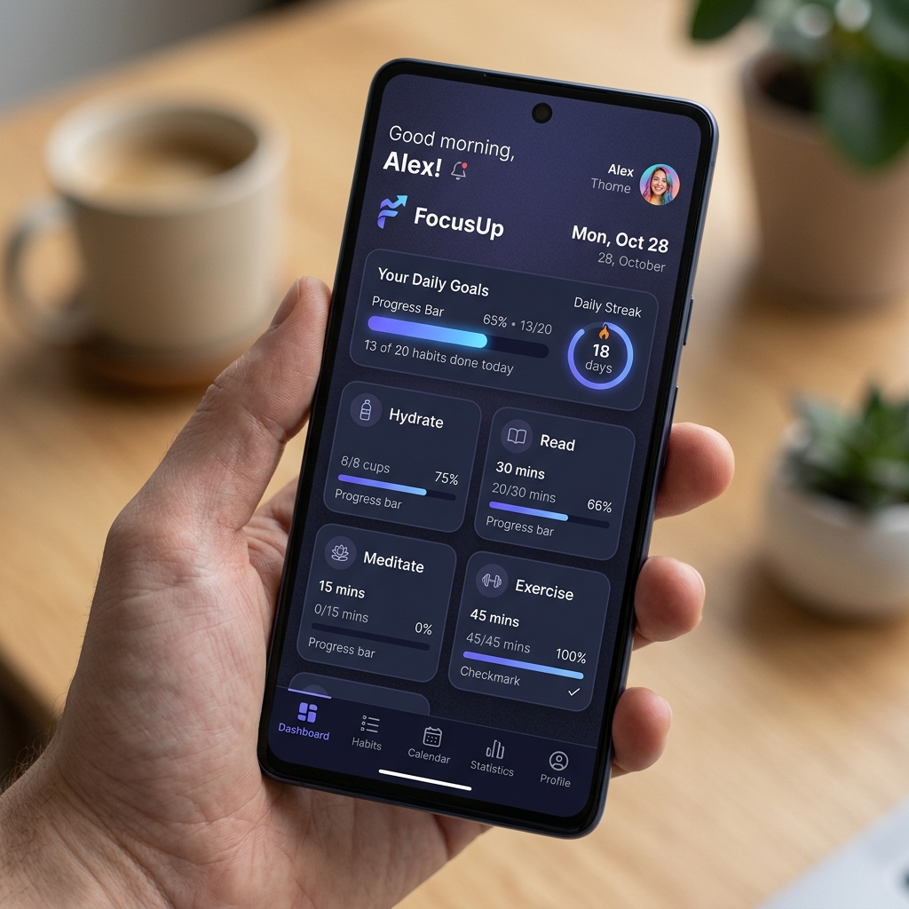

# FocusUp - Aplicación Móvil de Seguimiento de Hábitos y Productividad



## 📌 Explicación del Diseño Replicado

**FocusUp** es una aplicación móvil nativa desarrollada con **React Native** y **Expo**. Su diseño replica la experiencia de usuario y elegancia visual de aplicaciones móviles comerciales como *Uber*, *Instagram* o *Airbnb*, organizando componentes Core nativos con animaciones fluidas, gradientes y tarjetas de seguimiento personal.

---

## 📝 Requisitos Técnicos Cumplidos

### 1. Contenedor Principal
- **`<SafeAreaView>`**: Garantiza la perfecta adaptación en dispositivos móviles iOS y Android.
- **`<ScrollView>`**: Permite desplazamiento continuo y fluido en todas las vistas.

### 2. Componentes Core Obligatorios
- **`<TextInput>` Funcional**: 
  - Campos de entrada de datos en la pantalla de inicio de sesión (`LoginScreen.js`) para capturar el nombre del usuario, correo electrónico y contraseña.
  - Campos de texto en el formulario de creación de hábitos (`CreateHabitScreen.js`).
- **`<Image>`**:
  - Uso de imágenes y avatares de perfil con estilos nativos.
- **`<Pressable>` con Respuesta al Toque**:
  - Botones táctiles con respuestas dinámicas y opacidad en la navegación de pestañas inferiores, botones de acción del header, retorno `[←]`, botón de cerrar sesión (`logout`) y botones CTA principales.

---

## 🛠️ Cómo Ejecutar el Proyecto

1. **Instalar dependencias:**
   ```bash
   npm install
   ```

2. **Iniciar la aplicación en Expo:**
   ```bash
   npm start
   ```

---

## 📁 Estructura del Proyecto

```
actividad/
├── App.js                     # Componente principal de navegación (SafeAreaView + Animated)
├── screenshot.png             # Captura de pantalla de la aplicación
├── AI-LOG.md                  # Bitácora de Auditoría de IA
├── src/
│   ├── screens/
│   │   ├── HomeScreen.js      # Vista 1: Dashboard de hábitos
│   │   ├── LoginScreen.js     # Vista 2: Inicio de sesión e ingreso de nombre
│   │   ├── WelcomeScreen.js   # Vista 3: Onboarding interactivo en 3 pasos
│   │   ├── CreateHabitScreen.js # Formulario de creación de hábitos
│   │   └── ProgressScreen.js  # Estadísticas del usuario
│   ├── components/
│   │   ├── ProgressBar.js     # Barra de progreso reutilizable
│   │   ├── HabitCard.js       # Tarjetas interactivas de hábito
│   │   └── BottomNavigation.js# Navegación inferior
│   └── styles/
│       └── theme.js           # Tema nativo, colores y sombras
```

---

**Desarrollado con React Native & Expo.**
