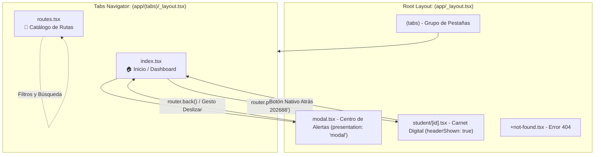

# Taller Práctico: Arquitectura de Navegación con Expo Router

**Estudiante:** Juan Carlos Añez Ahumada  
**Asignatura:** Desarrollo Móvil - Grupo B1  
**Proyecto:** RouteGo App (Sistema de Transporte Universitario)  
**Tecnología:** Expo SDK 52+ / Expo Router / TypeScript  

---

## 🚀 Fase 1: Wireframe y Mapa de Navegación (Diseño Previo)

Antes de iniciar la codificación, se diseñó la estructura y mapa de navegación para la aplicación de transporte universitario **RouteGo**, respondiendo a las preguntas de arquitectura fundamentales:

### 1.1 Respuestas a las Preguntas de Diseño

1. **¿Cuáles serán las 2 o 3 pantallas principales que vivirán en la barra inferior (Tabs)?**  
   - **Pestaña 1 (`/` - `app/(tabs)/index.tsx`):** *Inicio / Dashboard Principal*. Concentra el estado en tiempo real del próximo autobús, accesos rápidos a carnet y alertas, métricas de la red de transporte y salidas inminentes.  
   - **Pestaña 2 (`/routes` - `app/(tabs)/routes.tsx`):** *Explorador de Rutas Universitarias*. Permite buscar, filtrar por estado (activas, demoradas, favoritas) e inspeccionar los circuitos y paradas del campus.

2. **¿Qué pantalla requiere presentarse de manera jerárquica con botón de regreso (Stack)?**  
   - **Pantalla de Detalle (`/student/[id]` - `app/student/[id].tsx`):** Presenta el expediente y *Carnet Digital de Transporte* del estudiante. Se apila sobre el navegador principal manteniendo una cabecera nativa con título y botón de regreso (`headerBackTitle: 'Atrás'`).

3. **¿Qué pantalla mostrará contenido dinámico dependiente de un identificador único (Ruta Dinámica `[id]`)?**  
   - **Ruta Dinámica `app/student/[id].tsx`:** Permite consultar los datos, viajes y monedero de cualquier estudiante parametrizado por su código institucional (por ejemplo: `ST-202688`, `ST-409112`, etc.), extrayendo dicho parámetro mediante `useLocalSearchParams`.

4. **¿Qué flujo justifica una apertura de tipo Modal?**  
   - **Pantalla Modal (`/modal` - `app/modal.tsx`):** *Centro de Estado y Alertas del Servicio*. Muestra comunicados urgentes, estado porcentual de la flota, líneas de emergencia y formulario de reporte de incidentes. Se presenta como diálogo flotante superpuesto (`presentation: 'modal'`) para que el usuario consulte incidencias críticas sin perder el contexto de su pantalla previa ni reiniciar el scroll.

---

### 1.2 Diagrama de Flujo y Navegación (Mermaid)



---

### 1.3 Wireframe Conceptual de las Pantallas

```text
┌───────────────────────────┐     ┌───────────────────────────┐     ┌───────────────────────────┐
│     RouteGo - Inicio      │     │  Centro de Alertas (Modal)│     │ Carnet Digital (Dynamic)  │
├───────────────────────────┤     ├───────────────────────────┤     ├───────────────────────────┤
│ ¡Hola, Juan Carlos! 👋    │     │ [X] Cerrar                │     │ < Atrás  Carnet Digital   │
│                           │     │                           │     │                           │
│ ┌───────────────────────┐ │Link │ ⚠️ Estado de la Red       │     │ [id]: "ST-202688"         │
│ │ Próximo Bus: R-01     │ ├────►│ Flota Activa: 92%         │     │ Estudiante: Juan C. Pérez │
│ │ [ Ver Alertas (Modal) ] │ │     │                           │     │ Programa: Ing. Sistemas   │
│ └───────────────────────┘ │     │ Comunicados:              │     │ Saldo: $24.500 COP        │
│                           │     │ - Vía Perimetral cerrada  │     │                           │
│ Acciones Rápidas:         │     │                           │     │ [ Generar Código QR ]     │
│ [ Mi Carnet ST-202688 ] ──┼─────┼───────────────────────────┼────►│ Historial de Viajes       │
│      (useRouter.push)     │     │ Reportar Incidente:       │     │ - Ruta Norte (07:15 AM)   │
│                           │     │ [ Enviar Reporte ]        │     │ - Ruta Campus (01:30 PM)  │
├───────────────────────────┤     └───────────────────────────┘     └───────────────────────────┘
│  [🏠 Inicio]   [🚌 Rutas] │
└───────────────────────────┘
```

---

## 🔗 Fase 2: Explicación del Flujo de Navegación

La aplicación combina armónicamente los tres grandes patrones de navegación en dispositivos móviles: **Navegación por Pestañas (Tabs)**, **Pila Jerárquica (Stack)** y **Pantalla Superpuesta (Modal)**.

1. **Jerarquía Raíz (`app/_layout.tsx`):**
   - El punto de entrada principal envuelve la experiencia en un componente `<Stack/>`.
   - Registra el grupo de navegación inferior `(tabs)` con `headerShown: false` para ceder el control visual a cada vista.
   - Registra la pantalla `modal` asignando la propiedad nativa `presentation: 'modal'`, permitiendo que en iOS/Android se abra con animación de hoja inferior deslizable.
   - Registra la ruta dinámica `student/[id]` configurando `headerShown: true` y `headerBackTitle: 'Atrás'`, habilitando la flecha nativa de retroceso en el encabezado.

2. **Navegación Declarativa hacia el Modal:**
   - En la pestaña de Inicio ([`app/(tabs)/index.tsx`](file:///c:/Proyectos/desarrolloMovil/routego-app/app/(tabs)/index.tsx)), se utiliza el componente `<Link href="/modal" asChild>`:
     ```tsx
     <Link href="/modal" asChild>
       <Pressable style={styles.heroStatusBtn}>
         <Ionicons name="information-circle-outline" size={16} color="#93C5FD" />
         <Text style={styles.heroStatusBtnText}>Alertas</Text>
       </Pressable>
     </Link>
     ```
   - Al pulsar el componente, el motor de Expo Router monta [`app/modal.tsx`](file:///c:/Proyectos/desarrolloMovil/routego-app/app/modal.tsx) sobre la pila sin destruir la vista de origen. Al cerrarse mediante `router.back()`, el usuario retoma exactamente la misma posición de scroll.

3. **Navegación Programática y Paso de Parámetros Dinámicos:**
   - En la misma pantalla principal, se implementa navegación dirigida por eventos con el hook `useRouter()`:
     ```tsx
     const router = useRouter();
     // Invocación al presionar la tarjeta de carnet o el avatar:
     router.push('/student/ST-202688');
     ```
   - Esta acción envía el identificador único `ST-202688` en el segmento de la URL hacia el archivo [`app/student/[id].tsx`](file:///c:/Proyectos/desarrolloMovil/routego-app/app/student/[id].tsx).

4. **Lectura y Visualización del Parámetro Dinámico:**
   - Dentro de [`app/student/[id].tsx`](file:///c:/Proyectos/desarrolloMovil/routego-app/app/student/[id].tsx), el hook `useLocalSearchParams` extrae el valor `id`:
     ```tsx
     const { id } = useLocalSearchParams<{ id: string }>();
     const studentId = (Array.isArray(id) ? id[0] : id) || 'ST-202688';
     ```
   - Este parámetro se imprime directamente en pantalla en un banner informativo visible (`[id] = "ST-202688"`) y se utiliza para cargar el perfil y balance del estudiante correspondiente.

---

## 🧠 Fase 3: Análisis de Arquitectura con IA

### 3.1 Estructura de Archivos del Proyecto

Salida generada en consola mediante `npx tree-node-cli -L 3 -I "node_modules|.git|.expo"`:

```text
routego-app
├── AGENTS.md
├── ARCHITECTURE.md
├── LICENSE
├── README.md
├── app
│   ├── (tabs)
│   │   ├── _layout.tsx         # Layout del Tabs Navigator
│   │   ├── index.tsx           # Pestaña Principal 1 (Dashboard)
│   │   └── routes.tsx          # Pestaña Principal 2 (Catálogo de Rutas)
│   ├── +not-found.tsx          # Pantalla de respaldo para rutas inexistentes (404)
│   ├── _layout.tsx             # Root Layout (Stack Principal)
│   ├── modal.tsx               # Pantalla Modal independiente (Alertas)
│   └── student
│       └── [id].tsx            # Ruta dinámica de estudiante
├── app.json
├── assets
│   └── images/
├── declarations.d.ts
├── eslint.config.js
├── expo-env.d.ts
├── package.json
├── src
│   ├── components/             # Componentes de UI atómicos (Botones, Tarjetas, Inputs)
│   ├── constants/              # Colores de marca, bordes y tipografía
│   ├── features/               # Módulos de dominio funcional (routes, status, student)
│   │   ├── routes/
│   │   ├── status/
│   │   └── student/
│   ├── global.css
│   └── hooks/                  # Custom Hooks reutilizables
└── tsconfig.json
```

---

### 3.2 Prompt de Auditoría Formulado a la IA

> **Rol Asignado:** Arquitecto Senior de Software en React Native  
> **Consulta:**  
> *"Actúa como un Arquitecto Senior de Software en React Native. Analiza la estructura de archivos que utilicé para mi aplicación en Expo Router:*  
> *[Estructura de carpetas RouteGo]*  
> *Por favor:*  
> *1. Evalúa si mi separación de conceptos entre rutas y lógica de negocio es adecuada.*  
> *2. Propón una arquitectura alternativa profesional basada en el patrón Feature-First (creando una carpeta /src fuera de /app).*  
> *3. Explica 2 ventajas y 2 desventajas de migrar mi proyecto a esa arquitectura sugerida."*

---

### 3.3 Dictamen del Arquitecto Senior de Software

#### 1. Evaluación de la Separación de Conceptos
En la implementación de **RouteGo**, la separación de conceptos es **altamente adecuada y madura**. 
- La carpeta `app/` respeta el principio de **Rutas Delgadas (Thin Route Wrappers)**: sus archivos se concentran en registrar layouts, interpretar parámetros de URL (`useLocalSearchParams`) y delegar la renderización a componentes especializados.
- La presencia de `src/features/` evita el antipatrón más común en Expo Router: saturar las pantallas con lógica de estado, llamadas a APIs y subcomponentes gigantes en un solo archivo `.tsx`.

#### 2. Propuesta de Arquitectura Feature-First (`/src` fuera de `/app`)

Para un crecimiento sostenible a gran escala, la arquitectura recomendada organiza el código fuente en torno a las capacidades de negocio (features o dominios funcionales):

```text
routego-app/
├── app/                              # CAPA DE ENRUTAMIENTO (File-based Routing puro)
│   ├── (tabs)/
│   │   ├── _layout.tsx               # Montaje del Tab Bar
│   │   ├── index.tsx                 # Conector a <HomeScreenFeature />
│   │   └── routes.tsx                # Conector a <RoutesScreenFeature />
│   ├── student/
│   │   └── [id].tsx                  # Conector a <StudentDetailFeature studentId={id} />
│   ├── modal.tsx                     # Conector a <StatusModalFeature />
│   ├── _layout.tsx                   # Root Stack Provider
│   └── +not-found.tsx
│
└── src/                              # CAPA DE DOMINIO Y LÓGICA DE NEGOCIO
    ├── components/                   # UI Kit Reutilizable (Botones, Badges, Modales base)
    ├── constants/                    # Tokens de diseño (Colores, Espaciados, Sombras)
    ├── features/                     # MÓDULOS DE NEGOCIO (Feature-First)
    │   ├── routes/                   # Feature Rutas de Buses
    │   │   ├── components/           # RouteCard, RouteDetailModal, RouteFilterPills
    │   │   ├── hooks/                # useRoutesFilter, useShuttleTracker
    │   │   ├── routesData.ts         # Mock data / Contratos API
    │   │   └── types.ts              # Interfaces TypeScript de rutas
    │   ├── status/                   # Feature Centro de Monitoreo
    │   │   ├── components/           # FleetKPIGauge, ServiceAlertCard, IncidentReportForm
    │   │   └── statusData.ts         # KPIs de la flota y contactos
    │   └── student/                  # Feature Perfil y Pase Estudiantil
    │       ├── components/           # DigitalStudentCard, StudentSwitcher, TripHistoryList
    │       └── studentData.ts        # Catálogo de estudiantes y viajes
    ├── hooks/                        # Custom Hooks globales (useTheme, useNetworkStatus)
    └── services/                     # Clientes de red (Supabase, Firebase, Axios Client)
```

#### 3. Dos Ventajas Clave de la Arquitectura Feature-First

1. **Alta Cohesión y Aislamiento de Dominio (Mantenibilidad en Equipos):**  
   Al agrupar componentes, hooks, tipos y contratos de datos dentro de cada subcarpeta de `features/` (ej. `features/routes/`), los desarrolladores pueden trabajar simultáneamente en diferentes módulos sin generar conflictos de fusión (*merge conflicts*) en los archivos de navegación. Si un requerimiento cambia en las alertas, únicamente se modifica la carpeta `features/status/`.
2. **Reutilización y Testabilidad Desacoplada del Router:**  
   Al mantener las pantallas en `src/` independientes de Expo Router, los componentes de negocio pueden ser sometidos a pruebas unitarias con Jest y React Native Testing Library sin necesidad de simular (*mockear*) el árbol completo de navegación, URLs o parámetros de deep linking.

#### 4. Dos Desventajas de la Arquitectura Feature-First

1. **Sobrecarga de Boilerplate en Proyectos Pequeños:**  
   Para aplicaciones simples o prototipos rápidos (MVP), crear carpetas separadas de componentes, hooks y tipos para cada funcionalidad introduce una complejidad innecesaria y una mayor cantidad de saltos entre archivos (*context switching*).
2. **Curva de Aprendizaje y Disciplina en Dependencias Cruzadas:**  
   Requiere que el equipo de desarrollo establezca reglas estrictas de importación. Si una feature comienza a importar masivamente submódulos de otra feature de forma descontrolada, se rompe el principio de encapsulamiento, generando dependencias circulares complejas de depurar en React Native.

---

### 3.4 Conclusión Personal del Estudiante

> Como desarrollador en formación, considero que **sí aplicaría decididamente la arquitectura Feature-First en proyectos de gran escala**, debido a que en aplicaciones empresariales o institucionales como RouteGo el crecimiento desordenado de archivos dentro de `app/` termina convirtiendo las rutas en componentes monolíticos difíciles de probar y mantener; delegar la responsabilidad de la URL a Expo Router y aislar la lógica de dominio en módulos funcionales dentro de `src/` garantiza un código limpio, escalable, preparado para pruebas automatizadas y adaptable al trabajo simultáneo de múltiples programadores.

---

## 📋 Resumen de Cumplimiento de Rúbrica

| Criterio Evaluado | Estado | Evidencia en el Repositorio |
| :--- | :---: | :--- |
| **Diseño y Wireframe (Fase 1)** | ✅ Cumplido | Preguntas resueltas, diagrama Mermaid y wireframe ASCII en este documento. |
| **Navegación por Pestañas (Tabs)** | ✅ Cumplido | [`app/(tabs)/_layout.tsx`](file:///c:/Proyectos/desarrolloMovil/routego-app/app/(tabs)/_layout.tsx) con 2 pestañas funcionales con títulos e iconos. |
| **Ruta Modal (`presentation: 'modal'`)** | ✅ Cumplido | [`app/_layout.tsx`](file:///c:/Proyectos/desarrolloMovil/routego-app/app/_layout.tsx) y [`app/modal.tsx`](file:///c:/Proyectos/desarrolloMovil/routego-app/app/modal.tsx). |
| **Navegación Declarativa (`<Link>`)** | ✅ Cumplido | Implementado en [`app/(tabs)/index.tsx`](file:///c:/Proyectos/desarrolloMovil/routego-app/app/(tabs)/index.tsx#L74) con `<Link href="/modal">`. |
| **Navegación Programática (`useRouter`)** | ✅ Cumplido | Implementado en [`app/(tabs)/index.tsx`](file:///c:/Proyectos/desarrolloMovil/routego-app/app/(tabs)/index.tsx#L59) con `router.push()`. |
| **Ruta Dinámica y Lectura (`[id].tsx`)** | ✅ Cumplido | [`app/student/[id].tsx`](file:///c:/Proyectos/desarrolloMovil/routego-app/app/student/[id].tsx) usando `useLocalSearchParams` e impresión en `<Text>`. |
| **Pantalla 404 de respaldo** | ✅ Cumplido | [`app/+not-found.tsx`](file:///c:/Proyectos/desarrolloMovil/routego-app/app/+not-found.tsx). |
| **Análisis Comparativo con IA (Fase 3)** | ✅ Cumplido | Árbol `tree-node-cli`, dictamen de arquitectura, 2 ventajas, 2 desventajas y conclusión personal. |
